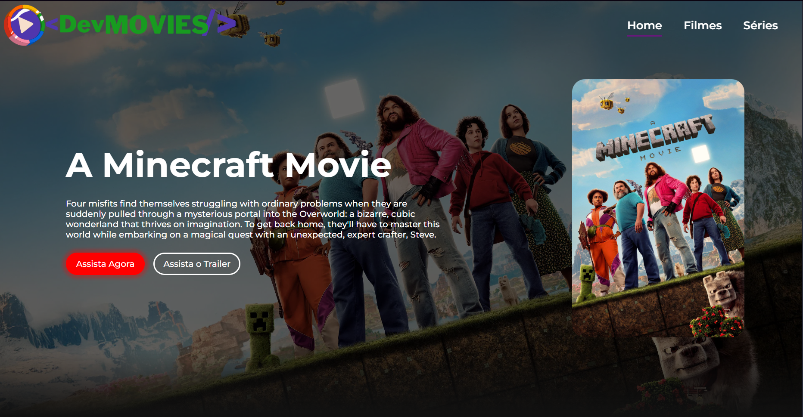
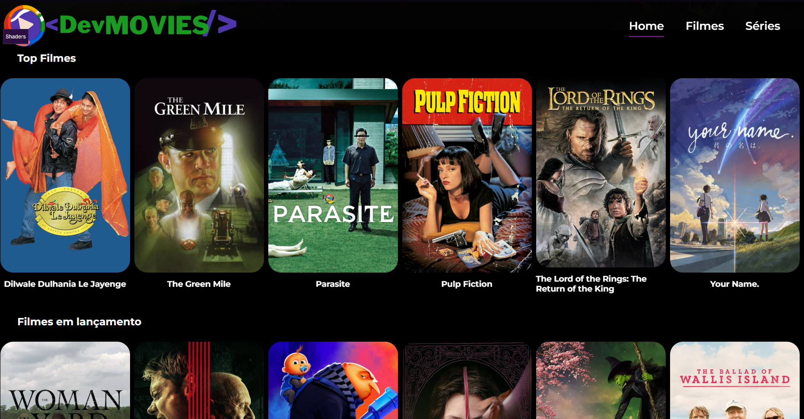

<h1>Esse é um Projeto que simula uma plataforma de Straming Grátis</h1>
 
<h2>O Principal objetico desse projeto é aprender consumir APIs com o Front-End</h2>
 
<h3>As tecnologias usadas foram:</h3>

<h4>As fotos do projeto estão logo abaixo:</h4>

